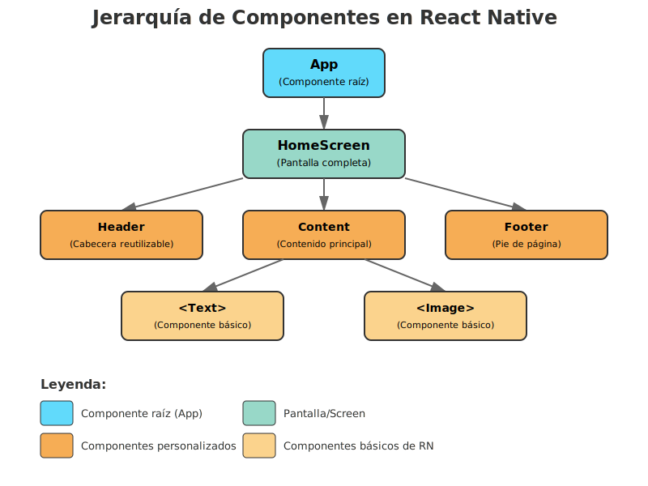
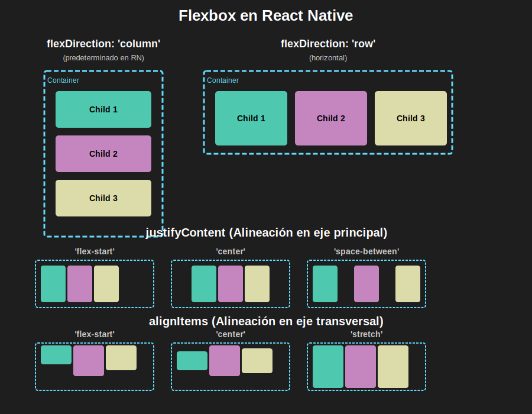

# Semana 1: Fundamentos de React Native

> **Bienvenido al Bootcamp de React Native 2025** 🚀  
> Esta es la primera de 6 semanas intensivas donde aprenderás a crear aplicaciones móviles profesionales.

---

> **🐛 IMPORTANTE:** El código de ejemplo de esta semana contiene **5 bugs intencionales** que debes identificar, corregir y documentar. Esto previene la copia mecánica y fomenta el aprendizaje activo. Ver [Sistema de Bugs Pedagógicos](../../_docs/instructor/bugs-pedagogicos.md).

---

## 🎯 Objetivos de Aprendizaje

Al finalizar esta semana, serás capaz de:

- [x] Configurar un entorno de desarrollo completo con Expo y React Native
- [x] Comprender la arquitectura básica de React Native
- [x] Crear componentes funcionales con TypeScript
- [x] Aplicar estilos usando NativeWind (TailwindCSS)
- [x] Manejar estado local con `useState`
- [x] Responder a eventos del usuario (onPress, onChange)
- [x] Renderizar listas de datos con `FlatList`
- [x] Estructurar una aplicación móvil básica
- [x] Desarrollar tu primer proyecto personal completo

---

## 📚 Contenido de la Semana

### 🎨 Diagramas Conceptuales

Visualizaciones que te ayudarán a entender los conceptos clave de esta semana:

**Jerarquía de Componentes en React Native**  
  
_Entiende cómo se estructuran los componentes desde la raíz hasta los elementos UI_

**Layouts con Flexbox**  
  
_Visualiza cómo funcionan flexDirection, justifyContent y alignItems_

> 💡 **Tip:** Estos diagramas están diseñados con tema oscuro para mejor visualización. [Ver todos los assets →](./0-assets/)

---

### 1️⃣ [Teoría](./1-teoria/)

**Duración:** 4.5 horas presenciales

Fundamentos teóricos presentados con demos en vivo:

1. **[Fundamentos de React Native](./1-teoria/01-fundamentos-react-native.md)** (45 min)

   - ¿Qué es React Native?
   - Arquitectura y funcionamiento
   - React Native vs otras alternativas
   - Ecosistema y herramientas

2. **[Setup y Componentes Básicos](./1-teoria/02-setup-y-componentes-basicos.md)** (2.5 horas)

   - Instalación de entorno (Node.js 22.20+, pnpm, Expo CLI)
   - Creación de proyecto con Expo
   - Componentes core: View, Text, Image, Button
   - Estilos con StyleSheet y NativeWind
   - Flexbox para layouts

> **💡 Si aún no has instalado pnpm, ejecuta:** `npm install -g pnpm` - [Guía completa](../../_docs/guias/instalacion-entorno.md)

3. **[Estado y Eventos](./1-teoria/03-estado-y-eventos.md)** (1.5 horas)
   - Hook `useState`
   - Manejo de eventos (onPress, onChange)
   - Renderizado condicional
   - Listas con FlatList
   - Props y comunicación entre componentes

---

### 2️⃣ [Prácticas Guiadas](./2-practicas/)

**Duración:** 2 horas presenciales (+ 30 min autónomo)

Ejercicios prácticos realizados en clase con el instructor:

1. **[Primera App: Perfil Personal](./2-practicas/practica-01-primera-app.md)** (45 min)

   - Setup del proyecto
   - Componentes básicos
   - Estilos con NativeWind
   - Estructura de carpetas

2. **[Card Component Reutilizable](./2-practicas/practica-02-card-component.md)** (45 min)

   - Crear componente personalizado
   - Props con TypeScript
   - Estilos flexibles
   - Reutilización

3. **[Lista de Contactos](./2-practicas/practica-03-lista-contactos.md)** (20 min clase + 30 min autónomo)
   - FlatList básico
   - Renderizado de items
   - Eventos onPress
   - **Completar en casa:** Agregar búsqueda y filtros

---

### 3️⃣ [Proyecto Integrador](./3-proyecto/)

**Duración:** 30 min presencial + 2 horas autónomo

**Proyecto:** Mi App Personal (Portfolio Mobile)

Aplicación que integra todos los conceptos de la semana:

- Pantalla de perfil con foto y datos personales
- Lista de habilidades técnicas
- Galería de proyectos
- Navegación básica entre secciones

**Archivos de soporte:**

- [README del Proyecto](./3-proyecto/README.md) - Guía completa paso a paso
- [Ejemplos de Datos](./3-proyecto/EJEMPLOS-DATOS.md) - 5 perfiles de ejemplo
- [Guía de Diseño](./3-proyecto/GUIA-DISENO.md) - Paletas de colores y componentes

**Evaluación:** 50% de la nota semanal  
**Entrega:** Viernes 23:59

---

### 4️⃣ [Recursos Complementarios](./4-recursos/)

**Material opcional** para reforzar y profundizar

- **[📚 eBooks Gratuitos](./4-recursos/ebooks-free/)** - 15 libros curados

  - React Native Express (⭐ Esencial)
  - TypeScript Handbook (Oficial)
  - JavaScript.info (Completo)
  - You Don't Know JS (Profundidad)

- **[🎥 Videografía](./4-recursos/videografia/)** - 15 videos + 8 canales

  - Crash courses (Traversy Media, Mosh)
  - Series completas (Net Ninja)
  - Canales recomendados de YouTube

- **[🌐 Webgrafía](./4-recursos/webgrafia/)** - 38 recursos web
  - Documentación oficial
  - Cheat sheets
  - Herramientas online
  - Recursos de diseño

> **Nota:** Estos recursos son **opcionales** y complementarios. Úsalos según tus necesidades de refuerzo o profundización.

---

### 5️⃣ [Glosario](./5-glosario/)

**Referencia rápida** de términos técnicos

Diccionario completo de 60+ términos:

- React Native (Component, Props, State, Hooks, JSX)
- TypeScript (Interface, tipos)
- JavaScript ES6+ (Arrow Functions, Async/Await, Promises)
- Expo (SDK, Expo Go, SecureStore)
- Estilos (NativeWind, Flexbox, StyleSheet)
- Herramientas (Git, pnpm, Metro, Babel)

**Uso:** Ctrl+F para buscar términos desconocidos

---

## ⏱️ Distribución del Tiempo

### 📍 Sesión Presencial (6 horas obligatorias)

| Actividad                        | Duración | Horario Sugerido |
| -------------------------------- | -------- | ---------------- |
| ☕ Bienvenida y setup            | 15 min   | 8:00 - 8:15      |
| 📖 Teoría 1: Fundamentos         | 45 min   | 8:15 - 9:00      |
| 📖 Teoría 2: Setup y Componentes | 2.5 h    | 9:00 - 11:30     |
| 🍕 **BREAK ALMUERZO**            | 30 min   | 11:30 - 12:00    |
| 📖 Teoría 3: Estado y Eventos    | 1.5 h    | 12:00 - 13:30    |
| 💻 Práctica 1: Primera App       | 45 min   | 13:30 - 14:15    |
| 💻 Práctica 2: Card Component    | 45 min   | 14:15 - 15:00    |
| 💻 Práctica 3: Lista (parte 1)   | 20 min   | 15:00 - 15:20    |
| 🚀 Presentación Proyecto Final   | 30 min   | 15:20 - 15:50    |
| ❓ Q&A y Cierre                  | 10 min   | 15:50 - 16:00    |

**Total:** 6 horas efectivas (8:00 AM - 4:00 PM con breaks)

---

### 🏠 Trabajo Autónomo (flexible, ~2.5 horas recomendadas)

| Actividad                       | Tiempo Estimado | Cuándo          |
| ------------------------------- | --------------- | --------------- |
| Completar Práctica 3 (filtros)  | 30 min          | Lunes-Martes    |
| Desarrollar Proyecto Integrador | 2 horas         | Martes-Jueves   |
| Revisar recursos opcionales     | Variable        | Según necesidad |

**Total recomendado:** ~2.5 horas (flexible según tu ritmo)

---

### 📊 Balance Total de la Semana

| Tipo                      | Horas     | Porcentaje |
| ------------------------- | --------- | ---------- |
| 👨‍🏫 Presencial obligatorio | 6.0 h     | **71%**    |
| 🏠 Autónomo core          | 2.5 h     | **29%**    |
| **TOTAL CORE**            | **8.5 h** | **100%**   |
| 📚 Recursos opcionales    | Variable  | Extra      |

> **Logro:** Balance ideal para bootcamp intensivo - mayoría presencial con soporte constante del instructor.

---

## 📋 Requisitos Previos

### Conocimientos Necesarios:

- ✅ JavaScript fundamentals (ES6+)
- ✅ HTML y CSS básicos
- ✅ Git y GitHub básicos
- ✅ Conceptos de programación (variables, funciones, objetos, arrays)

### Herramientas Requeridas:

- ✅ **Node.js 22.20+** (nunca menor - verificar con `node -v`)
- ✅ **pnpm 9.x** (gestor de paquetes - `pnpm -v`)
- ✅ **Visual Studio Code** (editor recomendado)
- ✅ **Git** configurado
- ✅ **Expo Go** instalado en tu móvil (iOS o Android)

### Configuración Inicial:

```bash
# Verificar versiones
node -v        # Debe ser >= 22.20.0
pnpm -v        # Debe ser >= 9.0.0
git --version

# Instalar Expo CLI globalmente
pnpm add -g expo-cli

# Verificar instalación
expo --version
```

> **Importante:** Todo se configurará **juntos en la sesión presencial**. Si tienes problemas, el instructor te ayudará en vivo.

---

## ✅ Criterios de Evaluación

> **Nota:** Esta semana incluye **5 bugs pedagógicos intencionales** en el código de ejemplo que debes identificar y corregir como parte de la evaluación (20 puntos).

### Distribución de Puntos (100 puntos totales)

| Componente             | Peso     | Puntos      |
| ---------------------- | -------- | ----------- |
| 📖 Comprensión Teórica | 15%      | 15 pts      |
| 💻 Prácticas Guiadas   | 25%      | 25 pts      |
| 🚀 Proyecto Integrador | 40%      | 40 pts      |
| 🐛 Bugs Resueltos      | 20%      | 20 pts      |
| **TOTAL**              | **100%** | **100 pts** |

---

### 1️⃣ Comprensión Teórica (20 puntos)

**Evaluación:** Participación en clase + Quiz corto al final

| Criterio                | Puntos | Descripción                                     |
| ----------------------- | ------ | ----------------------------------------------- |
| Conceptos fundamentales | 8 pts  | ¿Qué es React Native? Componentes, Props, State |
| Aplicación práctica     | 7 pts  | Uso correcto de hooks, eventos, estilos         |
| Resolución de problemas | 5 pts  | Debugging básico, interpretación de errores     |

**Escala:**

- 18-20: Excelente comprensión
- 15-17: Muy buena comprensión
- 12-14: Buena comprensión
- 9-11: Comprensión suficiente
- 0-8: Necesita refuerzo

---

### 2️⃣ Prácticas Guiadas (30 puntos)

**Evaluación:** Completitud y calidad de las 3 prácticas

#### Práctica 1: Primera App (10 pts)

- ✅ Setup correcto del proyecto (2 pts)
- ✅ Componentes básicos implementados (4 pts)
- ✅ Estilos con NativeWind (3 pts)
- ✅ App funcional sin errores (1 pt)

#### Práctica 2: Card Component (10 pts)

- ✅ Componente reutilizable (4 pts)
- ✅ Props con TypeScript correctamente tipados (3 pts)
- ✅ Estilos flexibles y responsivos (2 pts)
- ✅ Código limpio y documentado (1 pt)

#### Práctica 3: Lista de Contactos (10 pts)

- ✅ FlatList implementado correctamente (4 pts)
- ✅ Renderizado de items con eventos (3 pts)
- ✅ Búsqueda y filtros (parte autónoma) (2 pts)
- ✅ Performance optimizado (keyExtractor) (1 pt)

**Escala:**

- 27-30: Excelente ejecución
- 24-26: Muy buena ejecución
- 21-23: Buena ejecución
- 18-20: Ejecución suficiente
- 0-17: Necesita mejorar

---

### 3️⃣ Proyecto Integrador: Mi App Personal (50 puntos)

Ver [Rúbrica Detallada del Proyecto](./3-proyecto/README.md#-rúbrica-de-evaluación)

#### Funcionalidad (20 pts)

- Pantalla de perfil completa (6 pts)
- Lista de habilidades (6 pts)
- Galería de proyectos (6 pts)
- Navegación fluida (2 pts)

#### Calidad del Código (15 pts)

- TypeScript correctamente usado (5 pts)
- Componentes bien estructurados (4 pts)
- Props y state apropiados (3 pts)
- Código limpio y legible (3 pts)

#### Diseño y UX (10 pts)

- NativeWind/estilos coherentes (4 pts)
- Diseño atractivo y profesional (3 pts)
- Responsive y adaptable (3 pts)

#### Documentación (5 pts)

- README del proyecto (2 pts)
- Comentarios en código (2 pts)
- Instrucciones de ejecución (1 pt)

**Escala:**

- 45-50: Proyecto excelente
- 40-44: Proyecto muy bueno
- 35-39: Proyecto bueno
- 30-34: Proyecto suficiente
- 0-29: Necesita rehacer

---

### 🎯 Escala de Calificación Final

| Rango  | Calificación | Estado                |
| ------ | ------------ | --------------------- |
| 90-100 | Excelente    | ⭐⭐⭐                |
| 80-89  | Muy Bueno    | ⭐⭐                  |
| 70-79  | Bueno        | ⭐                    |
| 60-69  | Suficiente   | ✅                    |
| 0-59   | Insuficiente | ❌ Refuerzo necesario |

---

## 🚀 Entregables de la Semana

### 📦 Qué debes entregar:

1. **Prácticas 1, 2 y 3** (30%)

   - Repositorio Git con las 3 prácticas
   - Código funcionando sin errores
   - README con instrucciones de ejecución

2. **Proyecto Integrador** (50%)
   - Repositorio Git independiente
   - App completa y funcional
   - README con capturas de pantalla
   - Código comentado y limpio

### 📅 Fechas de Entrega:

| Entregable              | Fecha Límite    | Medio                            |
| ----------------------- | --------------- | -------------------------------- |
| Prácticas 1-3           | Jueves 23:59    | GitHub repo + link en plataforma |
| Proyecto Integrador     | Viernes 23:59   | GitHub repo + link en plataforma |
| Presentación (opcional) | Sábado en clase | Demostración en vivo             |

### 📤 Cómo Entregar:

1. **Sube tu código a GitHub:**

```bash
# Inicializar git (si no lo has hecho)
git init
git add .
git commit -m "feat: completar semana 1 - [tu nombre]"

# Crear repo en GitHub y subir
git remote add origin https://github.com/tu-usuario/semana-01-practicas.git
git push -u origin main
```

2. **Comparte el link:**

   - Copia la URL de tu repositorio
   - Pégala en la plataforma de entrega del bootcamp
   - Asegúrate de que el repo sea **público** o agrega al instructor como colaborador

3. **Incluye un README:**

```markdown
# Semana 1 - [Tu Nombre]

## Descripción

Prácticas y proyecto integrador de la primera semana del bootcamp.

## Cómo ejecutar

\`\`\`bash
pnpm install
pnpm start
\`\`\`

## Estructura

- /practica-01 - Primera App
- /practica-02 - Card Component
- /practica-03 - Lista de Contactos
- /proyecto - Mi App Personal

## Tecnologías

- React Native 0.74+
- Expo SDK 51+
- TypeScript 5.x
- NativeWind (TailwindCSS)
- Node.js 22.20+
```

---

## 💡 Consejos para Tener Éxito

### ✅ Durante la Clase Presencial:

1. **Llega puntual** - Setup inicial es crítico
2. **Haz preguntas** - Es el mejor momento para resolver dudas
3. **Toma notas** - Anota comandos y conceptos clave
4. **Practica en vivo** - Sigue los ejercicios del instructor
5. **Participa activamente** - Comparte pantalla si tienes errores

### ✅ Durante el Trabajo Autónomo:

1. **No dejes todo para el último día** - Distribuye las 2.5h en la semana
2. **Empieza con lo fácil** - Completa Práctica 3, luego el proyecto
3. **Usa el glosario** - Búsqueda rápida de términos (Ctrl+F)
4. **Consulta recursos** - Videos y documentación cuando te atasques
5. **Pide ayuda temprano** - Discord/Slack del bootcamp

### ✅ Para el Proyecto Integrador:

1. **Lee toda la guía primero** - Entiende qué se espera antes de empezar
2. **Usa los ejemplos** - `EJEMPLOS-DATOS.md` te da ideas de contenido
3. **Aplica la guía de diseño** - `GUIA-DISENO.md` tiene paletas y componentes
4. **Commit frecuentemente** - Git commits cada feature completada
5. **Prueba en dispositivo real** - Usa Expo Go en tu móvil

### ✅ Debugging Tips:

```bash
# Limpiar caché si hay problemas
pnpm start --clear

# Ver logs detallados
npx expo start --dev-client

# Reiniciar Metro bundler
r (en la terminal de expo)

# Recargar app
Shift + R (en Expo Go)
```

---

## 🆘 Soporte y Ayuda

### Durante la Semana:

1. **Discord del Bootcamp** - Canal #semana-01

   - Preguntas rápidas
   - Compartir recursos
   - Ayuda entre compañeros

2. **Office Hours Virtuales**

   - Martes y Jueves 7:00 PM - 8:00 PM
   - Zoom link en la plataforma
   - Revisión de código en vivo

3. **GitHub Issues**

   - Reporta bugs o problemas de setup
   - Comparte soluciones encontradas

4. **Email del Instructor**
   - Solo para temas individuales/privados
   - Respuesta en máx 24h

### Recursos de Troubleshooting:

- [Stack Overflow - React Native](https://stackoverflow.com/questions/tagged/react-native)
- [Expo Forums](https://forums.expo.dev/)
- [React Native Community Discord](https://discord.com/invite/reactnative)
- [GitHub - React Native Discussions](https://github.com/facebook/react-native/discussions)

---

## 📖 Lecturas Recomendadas Pre-Clase

Si quieres llegar preparado (opcional):

1. **React Native Basics** (30 min)

   - https://reactnative.dev/docs/getting-started

2. **TypeScript for React** (20 min)

   - https://react.dev/learn/typescript

3. **TailwindCSS Basics** (15 min)
   - https://tailwindcss.com/docs/utility-first

**Total:** ~1 hora (completamente opcional)

---

## 🎉 Qué Lograrás Esta Semana

Al terminar la Semana 1, habrás:

✅ **Configurado tu entorno completo** - Node.js, Expo, VS Code  
✅ **Creado tu primera app móvil** - Desde cero hasta funcionando  
✅ **Aprendido React Native fundamentals** - Componentes, Props, State  
✅ **Usado TypeScript en producción** - Tipos, interfaces, safety  
✅ **Aplicado TailwindCSS (NativeWind)** - Estilos modernos y rápidos  
✅ **Manejado estado y eventos** - Interactividad real  
✅ **Renderizado listas dinámicas** - FlatList optimizado  
✅ **Desarrollado un proyecto completo** - Portfolio personal funcional  
✅ **Practicado Git y GitHub** - Control de versiones profesional  
✅ **Construido una base sólida** - Lista para Semana 2 (Navegación)

---

## 🔜 Próxima Semana: Navegación y Routing

**Semana 2 Preview:**

- React Navigation fundamentals
- Stack, Tab y Drawer navigators
- Expo Router (file-based routing)
- Deep linking
- Passing parameters between screens
- Navigation lifecycle

**Preparación:** Tener tu proyecto de Semana 1 funcionando perfectamente, lo usaremos como base.

---

## 📊 Estadísticas del Bootcamp

- **Ficha:** 3147235
- **Estudiantes:** 26 aprendices
- **Duración Total:** 6 semanas
- **Horas Presenciales:** 36 horas (6h × 6 semanas)
- **Horas Autónomas:** ~15 horas (2.5h × 6 semanas)
- **Total Aproximado:** ~51 horas de aprendizaje intensivo

---

## 🎯 Filosofía del Bootcamp

> "Aprender haciendo, con guía constante del experto"

**Nuestro enfoque:**

- 🎓 **Mayoría presencial** - 70% con instructor en vivo
- 💻 **Práctico desde día 1** - Código real, no teoría abstracta
- 🚀 **Proyectos reales** - Portfolio que puedes mostrar
- 🤝 **Soporte continuo** - Office hours, Discord, email
- 📈 **Progresión gradual** - De básico a avanzado en 6 semanas
- 🌟 **Calidad profesional** - Estándares de la industria

---

## 📞 Contacto

**Instructor:** [Nombre del Instructor]  
**Email:** instructor@bootcamp.com  
**Discord:** @instructor  
**Office Hours:** Martes y Jueves 7-8 PM

**Coordinación Académica:**  
**Email:** coordinacion@bootcamp.com  
**Teléfono:** +57 xxx xxx xxxx

---

## ⚖️ Código de Conducta

- ✅ Respeto entre compañeros y con el instructor
- ✅ Puntualidad en sesiones presenciales
- ✅ Trabajo individual en evaluaciones (salvo indicación contraria)
- ✅ Citación de fuentes cuando uses código externo
- ❌ Plagio o copia directa entre compañeros

---

## 📜 Licencia y Uso

**Contenido del Bootcamp:**

- Material educativo de uso exclusivo para estudiantes del bootcamp
- Código de ejemplos y prácticas: Libre uso con atribución
- Proyectos personales de estudiantes: Propiedad del estudiante

**Tu Código:**

- ✅ Eres dueño de tu código y proyectos
- ✅ Puedes usarlos en tu portfolio
- ✅ Puedes publicarlos en GitHub
- ✅ Puedes adaptarlos para proyectos futuros

---

## 🙏 Agradecimientos

Gracias por tu compromiso y dedicación en esta primera semana. Recuerda:

> **"El experto en cualquier cosa fue una vez un principiante"** - Helen Hayes

Estás dando tus primeros pasos en React Native. No te compares con otros, compárate con el tú de ayer. Cada línea de código que escribes te acerca más a tus objetivos.

**¡Bienvenido al mundo del desarrollo móvil!** 🚀📱

---

## 📌 Recursos Rápidos

### Documentación Oficial:

- [React Native Docs](https://reactnative.dev/docs/getting-started)
- [Expo Docs](https://docs.expo.dev/)
- [TypeScript Handbook](https://www.typescriptlang.org/docs/)
- [NativeWind Docs](https://www.nativewind.dev/)

### Herramientas:

- [Expo Snack](https://snack.expo.dev/) - Editor online
- [React Native Directory](https://reactnative.directory/) - Librerías
- [Awesome React Native](https://github.com/jondot/awesome-react-native) - Recursos curados

### Comunidad:

- [React Native Community Discord](https://discord.com/invite/reactnative)
- [r/reactnative](https://www.reddit.com/r/reactnative/)
- [Twitter: #ReactNative](https://twitter.com/hashtag/reactnative)

---

<div align="center">

**Bootcamp React Native 2025**  
Semana 1 de 6 | Fundamentos

[⬅️ Inicio del Bootcamp](../) | [Siguiente: Semana 2 ➡️](../semana-02/)

---

_Última actualización: 11 de octubre de 2025_  
_Versión: 1.0.0_

</div>
