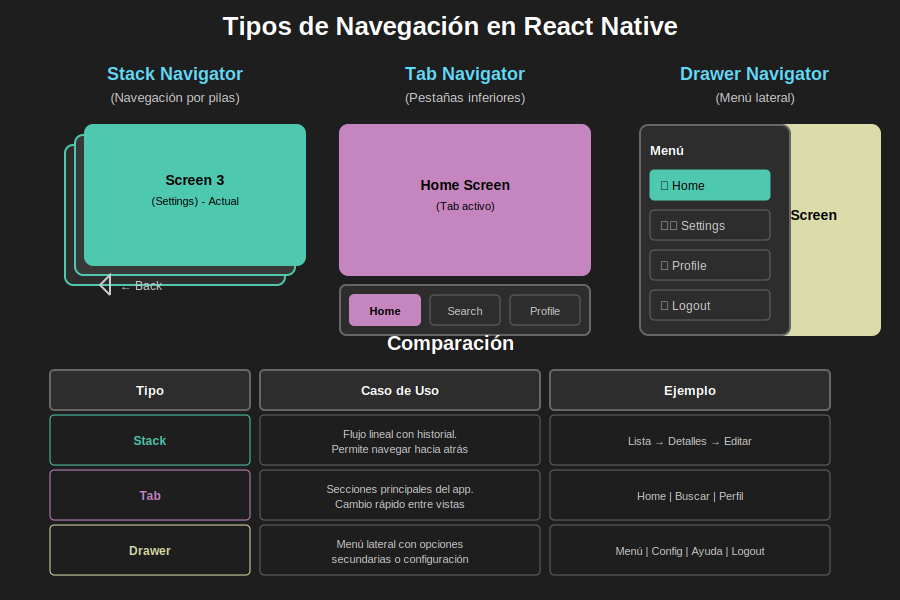

# 🧭 Semana 2: Navegación en React Native

> **Domina la navegación móvil** con React Navigation 6, implementando Stack, Tab y Drawer Navigators con arquitecturas anidadas profesionales.

---

> **🐛 IMPORTANTE:** El código de ejemplo de esta semana contiene **7 bugs intencionales** que debes identificar, corregir y documentar. Esto previene la copia mecánica y fomenta el aprendizaje activo. Ver [Sistema de Bugs Pedagógicos](../../_docs/instructor/bugs-pedagogicos.md).

---

## 📊 Vista General de la Semana

| Aspecto           | Detalle                                                       |
| ----------------- | ------------------------------------------------------------- |
| 🎯 **Enfoque**    | Navegación entre pantallas con React Navigation               |
| ⏱️ **Duración**   | 6 horas presenciales + 1-2h autónomas (refuerzo opcional)     |
| 📚 **Temas**      | Stack, Tab, Drawer Navigator, Navegación Anidada, Context API |
| 💻 **Prácticas**  | 3 apps guiadas en clase (resultados inmediatos)               |
| 🚀 **Proyecto**   | App funcional completada en sesión presencial                 |
| 🐛 **Bugs**       | 7 bugs pedagógicos a resolver y documentar                    |
| 📈 **Dificultad** | ⭐⭐ Intermedia                                               |
| ✅ **Evaluación** | 100 puntos (teoría + prácticas + proyecto + bugs)             |

---

## 🎯 Objetivos de Aprendizaje

### 🎨 Diagrama Conceptual

**Tipos de Navegación en React Native**  
  
*Compara Stack, Tab y Drawer Navigator para entender cuándo usar cada uno*

> 💡 **Tip:** Este diagrama muestra las diferencias visuales y casos de uso de cada navegador. [Ver todos los assets →](./0-assets/)

---

Al finalizar esta semana, serás capaz de:

### Conocimientos Fundamentales

- [ ] **Comprender** los tres tipos principales de navegadores (Stack, Tab, Drawer)
- [ ] **Identificar** cuándo usar cada tipo de navegador según el caso de uso
- [ ] **Explicar** el concepto de navegación anidada y su arquitectura
- [ ] **Entender** el paso de parámetros entre pantallas
- [ ] **Dominar** los hooks principales de React Navigation

### Habilidades Técnicas

- [ ] **Implementar** Stack Navigator para flujos lineales
- [ ] **Configurar** Tab Navigator con iconos y badges
- [ ] **Crear** Drawer Navigator con menú lateral personalizado
- [ ] **Anidar** navegadores para arquitecturas complejas (Drawer → Tab → Stack)
- [ ] **Gestionar** estado global con Context API
- [ ] **Tipar** navegación con TypeScript para mayor seguridad

### Competencias Profesionales

- [ ] **Diseñar** arquitecturas de navegación escalables
- [ ] **Optimizar** flujos de usuario para mejor UX
- [ ] **Aplicar** mejores prácticas de la industria
- [ ] **Debuggear** problemas comunes de navegación
- [ ] **Documentar** decisiones de arquitectura

---

## 📚 Contenido de la Semana

**Total:** ~95 minutos de lectura

---

### 2️⃣ Prácticas (3 aplicaciones guiadas)

Ejercicios prácticos paso a paso:

| Práctica                                                                      | App               | Navegación     | Tiempo | Puntos |
| ----------------------------------------------------------------------------- | ----------------- | -------------- | ------ | ------ |
| [Práctica 1: Stack Navigator](./2-practicas/practica-01-stack-navigator.md)   | Blog App          | Stack + Modal  | 45 min | 10     |
| [Práctica 2: Tab Navigator](./2-practicas/practica-02-tab-navigator.md)       | Dashboard App     | Tab + Stack    | 45 min | 10     |
| [Práctica 3: Drawer Navigator](./2-practicas/practica-03-drawer-navigator.md) | Settings App      | Drawer + Stack | 30 min | 10     |
| [📋 Índice de Prácticas](./2-practicas/README.md)                             | Guía y evaluación | -              | 5 min  | -      |

**Total:** ~2 horas de práctica guiada  
**Evaluación:** 30 puntos (30% de la nota final)

#### 🎯 Qué Construirás:

**Práctica 1 - Blog App:**

- 3 pantallas (Lista, Detalle, Crear)
- Stack Navigator con modal
- Parámetros entre pantallas
- TypeScript types

**Práctica 2 - Dashboard App:**

- 6 pantallas en 3 tabs (Home, Search, Profile)
- Bottom Tab Navigator
- Navegación anidada (Stack dentro de Tabs)
- Badges dinámicos

**Práctica 3 - Settings App:**

- 4 pantallas con menú lateral
- Drawer Navigator personalizado
- Custom drawer content
- Context API para dark mode

---

### 3️⃣ Proyecto Integrador (E-Commerce App)

**Aplicación completa de comercio electrónico** con navegación profesional:

| Documento                                                            | Contenido                                   | Tiempo Estimado |
| -------------------------------------------------------------------- | ------------------------------------------- | --------------- |
| [🎯 Proyecto Principal](./3-proyecto/README.md)                      | Descripción completa, objetivos, evaluación | 10 min lectura  |
| [📋 Índice del Proyecto](./3-proyecto/INDICE.md)                     | Roadmap detallado, checklist de progreso    | 5 min           |
| [🏗️ Fase 1: Setup](./3-proyecto/FASE-01-SETUP.md)                    | Configuración inicial, tipos, mock data     | 30 min          |
| [🛒 Fase 2: Context](./3-proyecto/FASE-02-CONTEXT.md)                | CartContext, gestión de estado global       | 45 min          |
| [📦 Fases 3-7: Implementación](./3-proyecto/FASES-RESUMEN.md)        | Componentes, pantallas, navegación          | 5-6 horas       |
| [🗺️ Estructura de Navegación](./3-proyecto/ESTRUCTURA-NAVEGACION.md) | Arquitectura completa, diagramas, flujos    | 15 min lectura  |

#### 📱 Características del Proyecto:

**Arquitectura:**

- 🎨 **3 tipos de navegadores** anidados (Drawer → Tab → Stack)
- 📱 **16 pantallas** distribuidas en 3 stacks principales
- 🛒 **Carrito de compras** con Context API
- 🔐 **TypeScript** completo con types seguros

**Stacks Principales:**

1. **Home Stack** (Exploración)

   - Home, ProductList, ProductDetail
   - 21 productos en 5 categorías

2. **Cart Stack** (Proceso de Compra)

   - Cart, Checkout, Payment, OrderConfirmation
   - CRUD completo del carrito

3. **Profile Stack** (Gestión de Usuario)
   - Profile, Orders, Settings, EditProfile
   - Persistencia de preferencias

**Tiempo:**

- ⏱️ **Sesión Presencial:** 2-2.5 horas de práctica con ejemplos paso a paso
- 🏠 **Trabajo Autónomo:** 0 horas (TODO se hace en clase)

**Evaluación:** 50 puntos (50% de la nota final)

---

### 4️⃣ Recursos Complementarios

Material adicional para reforzar tu aprendizaje:

| Recurso                                                   | Contenido                              | Cantidad   |
| --------------------------------------------------------- | -------------------------------------- | ---------- |
| [📚 Índice de Recursos](./4-recursos/README.md)           | Guía de uso y organización             | -          |
| [📖 eBooks Gratuitos](./4-recursos/ebooks-free/README.md) | Libros descargables sobre navegación   | 6 libros   |
| [🎥 Videografía](./4-recursos/videografia/README.md)      | Tutoriales y cursos en video           | 20+ videos |
| [🌐 Webgrafía](./4-recursos/webgrafia/README.md)          | Artículos, docs oficiales, comunidades | 30+ links  |

#### 🔍 Recursos Destacados:

**📖 eBooks Must-Read:**

- React Navigation Official Guide (2024, ~150 páginas)
- React Native in Action (Nader Dabit)
- TypeScript Deep Dive (Basarat Ali Syed)

**🎥 Videos Must-Watch:**

- React Navigation 6 Complete Tutorial (Notjust.dev, 2h 15min)
- React Native Navigation Full Course (freeCodeCamp, 1h 45min)

**🌐 Documentación Oficial:**

- [React Navigation](https://reactnavigation.org) - Fuente de verdad
- [Expo Navigation](https://docs.expo.dev/guides/routing-and-navigation/)
- [TypeScript Handbook](https://www.typescriptlang.org/docs/)

---

### 5️⃣ Glosario Técnico

| Recurso                               | Contenido                             | Términos |
| ------------------------------------- | ------------------------------------- | -------- |
| [📖 Glosario](./5-glosario/README.md) | Diccionario de términos de navegación | 80+      |

**Incluye:**

- Definiciones en inglés y español
- Ejemplos de código
- Referencias cruzadas
- Categorización temática
- Checklist de comprensión

**Términos clave:** Navigator, Stack, Tab, Drawer, Route, Params, Navigation Prop, Context, ParamList, Push, Pop, Navigate, etc.

---

## ⏱️ Cronograma Sugerido

### 📅 Sesión Presencial (6 horas - Obligatoria)

| Horario     | Actividad                                      | Duración | Tipo           |
| ----------- | ---------------------------------------------- | -------- | -------------- |
| 09:00-09:15 | Bienvenida y objetivos de la semana            | 15 min   | Introducción   |
| 09:15-09:45 | **Teoría 1:** Intro React Navigation + Demo    | 30 min   | Clase práctica |
| 09:45-10:30 | **Práctica 1:** Stack Navigator (TODOS juntos) | 45 min   | Live coding    |
| 10:30-10:45 | ☕ Break + Verificación de código              | 15 min   | Descanso       |
| 10:45-11:30 | **Teoría 2:** Tab Navigator + Demo en vivo     | 45 min   | Clase práctica |
| 11:30-12:15 | **Práctica 2:** Tab Navigator (TODOS juntos)   | 45 min   | Live coding    |
| 12:15-13:15 | 🍽️ Almuerzo                                    | 60 min   | Descanso       |
| 13:15-13:45 | **Teoría 3:** Drawer Navigator + Demo          | 30 min   | Clase práctica |
| 13:45-14:15 | **Práctica 3:** Drawer (TODOS juntos)          | 30 min   | Live coding    |
| 14:15-14:30 | ☕ Break                                       | 15 min   | Descanso       |
| 14:30-16:30 | **Proyecto:** Implementación completa          | 2h       | Live coding    |
| 16:30-17:00 | Verificación final, testing y cierre           | 30 min   | Q&A + Demo     |

**Total:** 6 horas efectivas (sin contar breaks y almuerzo)

---

### 🏠 Trabajo Autónomo (1-2h opcional - Solo refuerzo)

> **IMPORTANTE:** El bootcamp está diseñado para que **TODO lo esencial se complete en la sesión presencial de 6 horas**. El trabajo autónomo es **opcional** y solo para reforzar conceptos si lo deseas.

#### ✅ ¿Qué se completa en las 6 horas presenciales?

✅ **Toda la teoría** explicada y aplicada  
✅ **Las 3 prácticas** completadas con código funcional  
✅ **El proyecto principal** con navegación funcionando  
✅ **Verificación inmediata** de que todo funciona  
✅ **Dudas resueltas** en tiempo real

#### 📚 Trabajo Autónomo Opcional (1-2h máximo)

**Solo si quieres reforzar:**

- [ ] **30-45 min:** Revisar notas de clase y documentación oficial
- [ ] **30-45 min:** Ver 1-2 videos recomendados sobre navegación
- [ ] **15-30 min:** Experimentar con pequeñas personalizaciones (colores, iconos)

**NO necesitas:**

- ❌ Completar código fuera de clase (TODO se termina en la sesión)
- ❌ Hacer ejercicios extras extensos
- ❌ Leer toda la documentación
- ❌ Ver todos los videos
- ❌ Dedicar horas fuera de la sesión

#### 🎯 Filosofía del Bootcamp

Este bootcamp NO es para desarrollar el proyecto formativo de 7mo trimestre. Es para:

✅ **Aprender fundamentos** de React Native en 6 semanas  
✅ **Práctica intensiva** en sesiones presenciales  
✅ **Resultados inmediatos** verificables en clase  
✅ **Bases sólidas** para que luego puedan desarrollar sus propios proyectos

**El proyecto formativo (app móvil de 7mo trimestre) es POSTERIOR y está FUERA del alcance de este bootcamp.**

---

## ✅ Evaluación y Calificación

### 📊 Distribución de Puntos (100 puntos totales)

| Componente    | Peso | Puntos  | Descripción                            |
| ------------- | ---- | ------- | -------------------------------------- |
| **Teoría**    | 20%  | 20      | Comprensión de conceptos de navegación |
| **Prácticas** | 30%  | 30      | 3 apps completadas (10 pts c/u)        |
| **Proyecto**  | 50%  | 50      | E-Commerce App completo                |
| **TOTAL**     | 100% | **100** | Puntuación máxima                      |

### 📋 Rúbrica Detallada

**Ver:** [RUBRICA-EVALUACION.md](./RUBRICA-EVALUACION.md) para criterios completos

**Resumen:**

#### 1. Teoría (20 pts)

- Comprensión de conceptos: 10 pts
- Aplicación de conocimientos: 10 pts

#### 2. Prácticas (30 pts)

- Stack Navigator - Blog App: 10 pts
- Tab Navigator - Dashboard: 10 pts
- Drawer Navigator - Settings: 10 pts

#### 3. Proyecto (50 pts)

- Funcionalidad (Home, Cart, Profile): 20 pts
- Arquitectura de navegación: 12 pts
- Calidad del código: 10 pts
- Context API: 5 pts
- UI/UX: 3 pts

### 🎯 Escala de Calificación

| Rango  | Calificación | Descripción                           |
| ------ | ------------ | ------------------------------------- |
| 90-100 | Excelente    | Dominio completo, supera expectativas |
| 80-89  | Muy Bueno    | Dominio sólido, cumple todo           |
| 70-79  | Bueno        | Comprensión adecuada                  |
| 60-69  | Suficiente   | Comprensión mínima, necesita refuerzo |
| 0-59   | Insuficiente | No cumple requisitos mínimos          |

### 📅 Fechas Importantes

| Evento               | Fecha                   | Notas                           |
| -------------------- | ----------------------- | ------------------------------- |
| Sesión presencial    | Día 1 de la semana      | 6 horas, asistencia obligatoria |
| Entrega de prácticas | Día 5 (viernes)         | 3 apps completadas              |
| Entrega de proyecto  | Día 6 (sábado)          | E-Commerce App completo         |
| Evaluación teórica   | Día 7 (domingo) o Día 1 | Quiz o entrevista               |
| Feedback y revisión  | Día 1 semana siguiente  | Resultados y mejoras            |

---

## 🚀 Cómo Navegar Esta Semana

### 🗺️ Ruta de Aprendizaje Recomendada

```
1. Lee el README (este archivo) ✅
   ↓
2. Estudia la TEORÍA (1-teoria/)
   - 01-introduccion-react-navigation.md
   - 02-stack-navigator.md
   - 03-tab-drawer-navigator.md
   ↓
3. Completa las PRÁCTICAS (2-practicas/)
   - practica-01-stack-navigator.md
   - practica-02-tab-navigator.md
   - practica-03-drawer-navigator.md
   ↓
4. Desarrolla el PROYECTO (3-proyecto/)
   - Lee README.md y INDICE.md
   - Implementa Fase 1: Setup
   - Implementa Fase 2: Context
   - Desarrolla los 3 stacks (Fases 3-7)
   - Integra navegación completa
   ↓
5. Consulta RECURSOS cuando necesites (4-recursos/)
   - eBooks para profundizar
   - Videos para reforzar
   - Webgrafía para resolver dudas
   ↓
6. Usa el GLOSARIO como referencia (5-glosario/)
   ↓
7. Auto-evalúate con la RÚBRICA
   ↓
8. ENTREGA tu proyecto ✅
```

### 📖 Guías de Uso

#### Para Principiantes:

1. ✅ Lee **toda la teoría** antes de empezar a programar
2. ✅ Completa las **prácticas en orden**, no te saltes pasos
3. ✅ Consulta el **glosario** cada vez que encuentres un término desconocido
4. ✅ Mira los **videos recomendados** para reforzar conceptos
5. ✅ Empieza el proyecto **solo después** de dominar las prácticas

#### Para Nivel Intermedio:

1. ✅ Repasa la teoría rápidamente
2. ✅ Completa las prácticas experimentando con personalizaciones
3. ✅ Inicia el proyecto desde el principio siguiendo las fases
4. ✅ Consulta los **eBooks** para conceptos avanzados
5. ✅ Agrega features extra al proyecto

#### Para Avanzados:

1. ✅ Lee la teoría como referencia
2. ✅ Optimiza las prácticas con mejores patrones
3. ✅ Implementa el proyecto con TypeScript estricto
4. ✅ Agrega features avanzadas (autenticación, deep linking)
5. ✅ Documenta tus decisiones de arquitectura

---

## 🛠️ Tecnologías y Herramientas

### Stack Tecnológico

| Tecnología           | Versión | Propósito                                                   |
| -------------------- | ------- | ----------------------------------------------------------- |
| **React Native**     | 0.74+   | Framework base                                              |
| **Expo**             | SDK 51+ | Plataforma de desarrollo                                    |
| **React Navigation** | 6.x     | Sistema de navegación                                       |
| **TypeScript**       | 5.x     | Tipado estático (opcional)                                  |
| **pnpm**             | 8.x     | Gestor de paquetes (**obligatorio**, 3x más rápido que npm) |
| **Node.js**          | 18.x+   | Runtime de JavaScript                                       |

### Librerías de Navegación

```bash
# Instaladas en las prácticas y proyecto
@react-navigation/native
@react-navigation/native-stack
@react-navigation/bottom-tabs
@react-navigation/drawer
react-native-screens
react-native-safe-area-context
react-native-gesture-handler
react-native-reanimated
```

### Herramientas Recomendadas

- **Editor:** VS Code con extensiones:
  - ES7+ React/Redux/React-Native snippets
  - TypeScript Importer
  - Prettier
  - ESLint
- **Testing:** Expo Go app (iOS/Android)
- **Debugging:** React Native Debugger, Flipper
- **Version Control:** Git + GitHub/GitLab

---

## 📦 Requisitos Previos

### Conocimientos Necesarios

✅ **Obligatorios:**

- JavaScript ES6+ (arrow functions, destructuring, modules)
- React básico (componentes, props, state, hooks)
- React Native fundamentos (View, Text, ScrollView, FlatList)
- pnpm comandos básicos (ver [¿Por qué pnpm?](../../_docs/guias/por-que-pnpm.md))
- Git básico

⚠️ **Recomendados:**

- TypeScript básico (types, interfaces)
- Context API de React
- Async/await
- Flexbox CSS

❌ **NO necesitas:**

- Redux (usaremos Context API)
- React Navigation 5 o anterior
- Conocimiento profundo de navegación nativa

### Configuración del Entorno

> **💡 Si aún no has instalado pnpm, ejecuta:** `npm install -g pnpm` - [Guía completa](../../_docs/guias/instalacion-entorno.md)

**Antes de empezar la semana, asegúrate de tener:**

✅ Node.js 18+ instalado  
✅ **pnpm instalado globalmente** - [¿Por qué pnpm?](../../_docs/guias/por-que-pnpm.md)  
✅ Expo CLI instalado (`pnpm add -g expo-cli`)  
✅ Expo Go app en tu dispositivo móvil  
✅ Cuenta de Expo creada  
✅ Editor de código configurado (VS Code recomendado)  
✅ Git configurado

> **⚡ IMPORTANTE:** Este bootcamp usa **pnpm exclusivamente** por su velocidad superior (3x más rápido) y eficiencia de espacio (80% menos). **NO uses npm**. Lee [¿Por qué pnpm?](../../_docs/guias/por-que-pnpm.md) para entender las ventajas.

**Verificar instalación:**

```bash
node --version    # >= 18.0.0
pnpm --version    # >= 8.0.0
expo --version    # >= 6.0.0
git --version     # Cualquier versión reciente
```

---

## 💡 Consejos para el Éxito

### 🎯 Para Maximizar tu Aprendizaje

1. **📚 No te saltes la teoría**

   - La navegación es conceptual, necesitas entender antes de implementar
   - Lee con atención los diagramas de arquitectura

2. **💻 Practica activamente**

   - Escribe todo el código, no copies y pegues
   - Experimenta modificando los ejemplos
   - Rompe cosas y arreglalas

3. **🐛 Debuggea con paciencia**

   - Los errores de navegación pueden ser confusos al principio
   - Lee los mensajes de error completos
   - Usa console.log para entender el flujo

4. **📖 Usa el glosario constantemente**

   - Cada término técnico está definido allí
   - Ayuda a hablar el "idioma" de React Navigation

5. **🤝 Colabora (sin copiar)**

   - Discute conceptos con compañeros
   - Explica tu código a otros (enseñar es aprender)
   - Pero el código debe ser 100% tuyo

6. **⏰ Gestiona tu tiempo**

   - No dejes todo para el último día
   - El proyecto toma ~7 horas, planifica bien
   - Sesiones de 1-2 horas son más efectivas que maratones

7. **🎨 Cuida la UI/UX**

   - Aunque sea funcional, hazlo visualmente agradable
   - Usa iconos apropiados
   - Piensa en el usuario final

8. **📝 Documenta tu código**
   - Comentarios en español explicando decisiones
   - README del proyecto con instrucciones
   - Tu yo del futuro te lo agradecerá

---

## ❓ Preguntas Frecuentes

### ¿Cuánto tiempo debo dedicar?

**Respuesta:** Las **6 horas presenciales obligatorias** donde se trabaja en las prácticas y el proyecto. El trabajo autónomo (1-2h) es **opcional** solo para reforzar conceptos.

### ¿Es obligatorio TypeScript?

**No**, pero suma puntos significativos y es una mejor práctica profesional. Los ejemplos incluyen versiones con y sin TypeScript.

### ¿Puedo usar Redux en lugar de Context API?

**No recomendado** para esta semana. Context API es suficiente y es parte de los objetivos de aprendizaje. Redux se verá en semanas posteriores.

### ¿Qué pasa si no termino en la sesión?

El instructor ajusta el ritmo para que todos avancen juntos. Si tienes dificultades, se resuelven inmediatamente. Las prácticas tienen instrucciones paso a paso muy detalladas para que puedas seguirlas a tu ritmo.

### ¿Puedo agregar features extra?

**Sí**, features bien implementados pueden compensar puntos en otras áreas o darte puntos bonus.

### ¿Dónde pedir ayuda?

1. Glosario y documentación de la semana
2. Recursos (eBooks, videos, webgrafía)
3. Documentación oficial de React Navigation
4. Instructor (office hours)
5. Compañeros (discusión, no copiar código)
6. Stack Overflow (tag: react-navigation)

### ¿Cómo sé si voy bien?

Usa el checklist de auto-evaluación en la rúbrica. Si completas todos los ítems, estás en buen camino.

### ¿Puedo usar Expo Router?

Para esta semana, **no**. Queremos que domines React Navigation puro. Expo Router se verá en semanas avanzadas.

---

## 🔗 Enlaces Rápidos

### 📚 Documentación de la Semana

- [Teoría](./1-teoria/)
- [Prácticas](./2-practicas/)
- [Proyecto](./3-proyecto/)
- [Recursos](./4-recursos/)
- [Glosario](./5-glosario/)
- [Rúbrica](./RUBRICA-EVALUACION.md)

### 🌐 Documentación Oficial

- [React Navigation](https://reactnavigation.org/)
- [Expo Documentation](https://docs.expo.dev/)
- [React Native Docs](https://reactnative.dev/)
- [TypeScript Handbook](https://www.typescriptlang.org/docs/)

### 🎥 Videos Recomendados

- [React Navigation 6 Tutorial](https://www.youtube.com/watch?v=nQVCkqvU1uE) (Notjust.dev)
- [React Native Navigation](https://www.youtube.com/watch?v=0FVh4i6RiXE) (freeCodeCamp)

### 💬 Comunidades

- [Reactiflux Discord](https://www.reactiflux.com/) (#react-native)
- [Reddit r/reactnative](https://www.reddit.com/r/reactnative/)
- [Stack Overflow](https://stackoverflow.com/questions/tagged/react-navigation)

---

## 📈 Próximos Pasos

### Después de Completar esta Semana

**Semana 3:** Estado y Datos

- State management avanzado (en clase)
- Context API patterns (práctica guiada)
- AsyncStorage y persistencia (live coding)
- Custom hooks (implementación en vivo)

**Preparación:**

- ✅ Asiste a la sesión presencial con tu laptop y app funcionando
- ✅ Trae preguntas sobre navegación (si las tienes)
- ❌ No necesitas estudiar nada antes (se explica todo en clase)

---

## 🎓 Reflexión Final

La navegación es la **columna vertebral** de cualquier aplicación móvil. En esta semana aprenderás:

✅ **En 6 horas presenciales** los fundamentos de React Navigation  
✅ **Con documentación detallada** paso a paso  
✅ **Resultados inmediatos** - app funcionando al final de la clase  
✅ **Bases sólidas** para luego desarrollar tus propios proyectos  
✅ **Sin carga excesiva** fuera del aula

**Objetivo:** Que salgas de la sesión presencial con una app completa funcionando y la confianza para crear más.

> **Nota importante:** Este bootcamp NO es para desarrollar tu proyecto formativo de 7mo trimestre. Es para aprender los fundamentos en 6 semanas intensivas. Tu proyecto de grado lo desarrollarás después, con las bases que aprendas aquí.

---

## ✨ Palabras del Instructor

> "La navegación no es solo mover de una pantalla a otra - es diseñar la experiencia del usuario. Piensa como usuario, programa como profesional."
>
> _— Tu Instructor de Bootcamp_

---

## 📞 Soporte y Contacto

**Instructor:**

- Office Hours: [Ver horarios en plataforma]
- Email: [contacto del bootcamp]
- Discord: [servidor del bootcamp]

**Grupo de Estudiantes:**

- WhatsApp/Discord: [link del grupo]
- Sesiones de estudio grupal: [horarios]

---

## 📝 Checklist de Inicio

Antes de comenzar, verifica:

- [ ] He leído este README completo
- [ ] Tengo mi entorno de desarrollo configurado
- [ ] He instalado todas las herramientas necesarias
- [ ] Entiendo el sistema de evaluación
- [ ] Conozco las fechas de entrega
- [ ] He revisado los requisitos previos
- [ ] Estoy listo para aprender navegación 🚀

---

## 🏁 ¡Comencemos!

**Primer paso:** Ve a [1-teoria/](./1-teoria/) y comienza con la introducción a React Navigation.

**¡Mucho éxito en esta semana!** 🎉

---

_Semana 2: Navegación en React Native_  
_Bootcamp React Native 2025 - EPTI_

**Última actualización:** Octubre 2025  
**Versión:** 1.0

---

## 📊 Estadísticas de la Semana

| Métrica                  | Valor                               |
| ------------------------ | ----------------------------------- |
| ⏱️ **Sesión presencial** | **6 horas (todo se hace en clase)** |
| 🏠 **Trabajo autónomo**  | **1-2h opcional (refuerzo)**        |
| 💻 Líneas de código      | ~800 (guiadas en vivo)              |
| 🎯 Objetivos aprendizaje | 8 esenciales                        |
| ✅ Evaluación            | Participación + app funcional       |
| 🔧 Tecnologías           | 4 principales                       |
| 📱 Apps a desarrollar    | 3 prácticas + 1 proyecto (en clase) |

---

**¿Listo para dominar la navegación móvil? ¡Adelante! 🚀**

**Bootcamp React Native 2025**  
Semana 2 de 6 | Navegación y Routing

[⬅️ Semana 1](../semana-01/) | [Siguiente: Semana 3 ➡️](../semana-03/)

---

_Última actualización: 11 de octubre de 2025_  
_Versión: 1.0.0_

</div>
