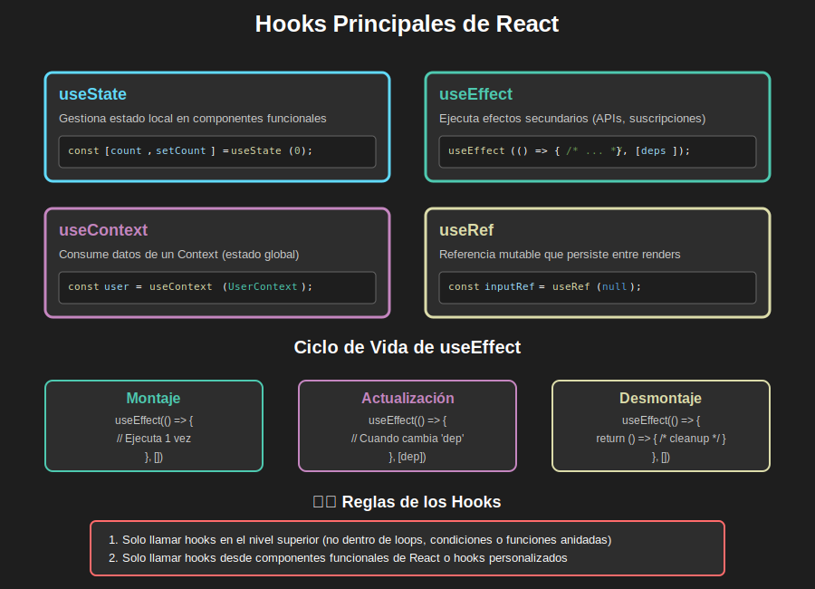

# 🗄️ Semana 3: Estado y Gestión de Datos

> **Domina el state management** con Context API, AsyncStorage y custom hooks para crear apps con datos persistentes y estado global.

---

> **🐛 IMPORTANTE:** El código de ejemplo de esta semana contiene **7 bugs intencionales** que debes identificar, corregir y documentar. Esto previene la copia mecánica y fomenta el aprendizaje activo. Ver [Sistema de Bugs Pedagógicos](../../_docs/instructor/bugs-pedagogicos.md).

---

## 📊 Vista General de la Semana

| Aspecto            | Detalle                                                      |
| ------------------ | ------------------------------------------------------------ |
| 🎯 **Enfoque**     | State Management, Context API, Persistencia de Datos         |
| ⏱️ **Duración**    | 6 horas presenciales + 1-2h autónomas (refuerzo opcional)    |
| 📚 **Temas**       | useState, useEffect, Context API, AsyncStorage, Custom Hooks |
| 💻 **Prácticas**   | 3 apps guiadas en clase (resultados inmediatos)              |
| 🚀 **Proyecto**    | Task Manager App completada en sesión presencial             |
| � **Bugs**         | 7 bugs pedagógicos a resolver y documentar                   |
| �📈 **Dificultad** | ⭐⭐⭐ Intermedia-Avanzada                                   |
| ✅ **Evaluación**  | 100 puntos (teoría + prácticas + proyecto + bugs)            |

---

## 🎯 Objetivos de Aprendizaje

### 🎨 Diagrama Conceptual

**Hooks Principales de React**  
  
*Visualiza useState, useEffect, useContext y useRef con su ciclo de vida*

> 💡 **Tip:** Este diagrama te ayudará a entender cuándo y cómo usar cada hook. [Ver todos los assets →](./0-assets/)

---

Al finalizar esta semana, serás capaz de:

### Conocimientos Fundamentales

- [ ] **Comprender** el flujo de datos en React (props vs state)
- [ ] **Dominar** useState y useEffect para estado local
- [ ] **Implementar** Context API para estado global
- [ ] **Persistir** datos con AsyncStorage
- [ ] **Crear** custom hooks reutilizables

### Habilidades Técnicas

- [ ] **Gestionar** estado complejo con useReducer
- [ ] **Compartir** estado entre múltiples componentes
- [ ] **Almacenar** datos localmente en el dispositivo
- [ ] **Sincronizar** estado con almacenamiento
- [ ] **Optimizar** re-renderizados con useMemo y useCallback

### Competencias Profesionales

- [ ] **Diseñar** arquitecturas de estado escalables
- [ ] **Aplicar** patrones de state management profesionales
- [ ] **Debuggear** problemas de estado y efectos
- [ ] **Documentar** la lógica de negocio

---

## 📚 Contenido de la Semana

### 1️⃣ Teoría (Demos en vivo)

| Tema                                               | Contenido                       | Tiempo |
| -------------------------------------------------- | ------------------------------- | ------ |
| [01. State Hooks](./1-teoria/01-state-hooks.md)    | useState, useEffect, useReducer | 45 min |
| [02. Context API](./1-teoria/02-context-api.md)    | Context, Provider, Consumer     | 45 min |
| [03. AsyncStorage](./1-teoria/03-async-storage.md) | Persistencia local de datos     | 30 min |

**Total:** ~2 horas de teoría con demos en vivo

---

### 2️⃣ Prácticas (Live Coding guiado)

| Práctica                                                        | App                       | Conceptos               | Tiempo |
| --------------------------------------------------------------- | ------------------------- | ----------------------- | ------ |
| [Práctica 1: Counter App](./2-practicas/practica-01-counter.md) | Contador con persistencia | useState + AsyncStorage | 45 min |
| [Práctica 2: Theme App](./2-practicas/practica-02-theme.md)     | Dark/Light mode           | Context API + Storage   | 45 min |
| [Práctica 3: Auth App](./2-practicas/practica-03-auth.md)       | Autenticación básica      | useReducer + Context    | 30 min |

**Total:** ~2 horas de práctica guiada  
**Evaluación:** 30 puntos (30% de la nota final)

---

### 3️⃣ Proyecto Integrador (Task Manager App)

**Aplicación completa de gestión de tareas** con estado global y persistencia:

#### 📱 Características del Proyecto:

**Funcionalidades:**

- ✅ **CRUD completo** de tareas (Crear, Leer, Actualizar, Eliminar)
- 🏷️ **Categorías** (Trabajo, Personal, Urgente)
- 🎨 **Prioridades** (Alta, Media, Baja)
- ✔️ **Marcar** tareas como completadas
- 💾 **Persistencia** con AsyncStorage
- 🔍 **Filtros** por categoría y estado
- 📊 **Estadísticas** de tareas

**Arquitectura:**

- 🗄️ **Context API** para estado global
- 🔄 **useReducer** para lógica compleja
- 💾 **AsyncStorage** para persistencia
- 🎣 **Custom hooks** (useTasks, useStorage)
- 📱 **8+ pantallas** con navegación

**Tiempo:**

- ⏱️ **Sesión Presencial:** 2-2.5 horas de práctica con ejemplos completos
- 🏠 **Trabajo Autónomo:** 0 horas (TODO se hace en clase)

**Evaluación:** 50 puntos (50% de la nota final)

---

### 4️⃣ Recursos Complementarios

Material adicional para reforzar tu aprendizaje:

| Recurso                               | Contenido                 | Uso        |
| ------------------------------------- | ------------------------- | ---------- |
| [📚 Recursos](./4-recursos/README.md) | eBooks, videos, artículos | Opcional   |
| [📖 Glosario](./5-glosario/README.md) | Términos técnicos         | Referencia |

---

## ⏱️ Cronograma Sugerido

> **💡 Si aún no has instalado pnpm, ejecuta:** `npm install -g pnpm` - [Guía completa](../../_docs/guias/instalacion-entorno.md)

### 📅 Sesión Presencial (6 horas - Obligatoria)

| Horario     | Actividad                                     | Duración | Tipo           |
| ----------- | --------------------------------------------- | -------- | -------------- |
| 09:00-09:15 | Bienvenida y objetivos de la semana           | 15 min   | Introducción   |
| 09:15-10:00 | **Teoría 1:** State Hooks + Demo en vivo      | 45 min   | Clase práctica |
| 10:00-10:45 | **Práctica 1:** Counter App (TODOS juntos)    | 45 min   | Live coding    |
| 10:45-11:00 | ☕ Break + Verificación                       | 15 min   | Descanso       |
| 11:00-11:45 | **Teoría 2:** Context API + Demo              | 45 min   | Clase práctica |
| 11:45-12:30 | **Práctica 2:** Theme App (TODOS juntos)      | 45 min   | Live coding    |
| 12:30-13:30 | 🍽️ Almuerzo                                   | 60 min   | Descanso       |
| 13:30-14:00 | **Teoría 3:** AsyncStorage + Demo             | 30 min   | Clase práctica |
| 14:00-14:30 | **Práctica 3:** Auth App (TODOS juntos)       | 30 min   | Live coding    |
| 14:30-14:45 | ☕ Break                                      | 15 min   | Descanso       |
| 14:45-17:00 | **Proyecto:** Task Manager guiado paso a paso | 2h 15min | Live coding    |
| 17:00-17:15 | Testing, verificación final y cierre          | 15 min   | Q&A + Demo     |

**Total:** 6 horas efectivas (sin contar breaks y almuerzo)

---

### 🏠 Trabajo Autónomo (1-2h opcional - Solo refuerzo)

> **IMPORTANTE:** El bootcamp está diseñado para que **TODO lo esencial se complete en la sesión presencial de 6 horas**. El trabajo autónomo es **opcional** y solo para reforzar conceptos si lo deseas.

#### ✅ ¿Qué se completa en las 6 horas presenciales?

✅ **Toda la teoría** de State Management aplicada  
✅ **Las 3 prácticas** con código funcional y datos persistentes  
✅ **El proyecto Task Manager** completo con CRUD  
✅ **Verificación inmediata** de que todo funciona  
✅ **Dudas resueltas** en tiempo real

#### 📚 Trabajo Autónomo Opcional (1-2h máximo)

**Solo si quieres reforzar:**

- [ ] **30-45 min:** Revisar documentación de React Hooks
- [ ] **30-45 min:** Ver 1-2 videos sobre Context API
- [ ] **15-30 min:** Experimentar con pequeñas mejoras a la app

**NO necesitas:**

- ❌ Completar código fuera de clase (TODO se termina en la sesión)
- ❌ Hacer ejercicios extras extensos
- ❌ Leer toda la documentación avanzada
- ❌ Ver todos los videos complementarios
- ❌ Dedicar horas extras fuera de la sesión

#### 🎯 Filosofía del Bootcamp

Este bootcamp NO es para desarrollar el proyecto formativo de 7mo trimestre. Es para:

✅ **Aprender fundamentos** de React Native en 6 semanas  
✅ **Práctica intensiva** en sesiones presenciales  
✅ **Resultados inmediatos** verificables en clase  
✅ **Bases sólidas** para que luego puedan desarrollar sus propios proyectos

**El proyecto formativo (app móvil de 7mo trimestre) es POSTERIOR y está FUERA del alcance de este bootcamp.**

---

## ✅ Evaluación y Calificación

> **Nota:** Esta semana incluye **7 bugs pedagógicos intencionales** en el código de ejemplo que debes identificar y corregir como parte de la evaluación (20 puntos).

### 📊 Distribución de Puntos (100 puntos totales)

| Componente    | Peso | Puntos  | Descripción                     |
| ------------- | ---- | ------- | ------------------------------- |
| **Teoría**    | 15%  | 15      | Comprensión de state management |
| **Prácticas** | 25%  | 25      | 3 apps completadas              |
| **Proyecto**  | 40%  | 40      | Task Manager App completo       |
| **Bugs**      | 20%  | 20      | Identificación y corrección     |
| **TOTAL**     | 100% | **100** | Puntuación máxima               |

### 📋 Rúbrica Detallada

**Ver:** [RUBRICA-EVALUACION.md](./RUBRICA-EVALUACION.md) para criterios completos de evaluación incluyendo bugs pedagógicos.

### 🎯 Escala de Calificación

| Rango  | Calificación | Descripción                           |
| ------ | ------------ | ------------------------------------- |
| 90-100 | Excelente    | Dominio completo, supera expectativas |
| 80-89  | Muy Bueno    | Dominio sólido, cumple todo           |
| 70-79  | Bueno        | Comprensión adecuada                  |
| 60-69  | Suficiente   | Comprensión mínima, necesita refuerzo |
| 0-59   | Insuficiente | No cumple requisitos mínimos          |

---

## 🛠️ Tecnologías y Herramientas

### Stack Tecnológico

| Tecnología       | Versión | Propósito                        |
| ---------------- | ------- | -------------------------------- |
| **React Native** | 0.74+   | Framework base                   |
| **Expo**         | SDK 51+ | Plataforma de desarrollo         |
| **AsyncStorage** | Latest  | Almacenamiento local             |
| **TypeScript**   | 5.x     | Tipado estático (opcional)       |
| **pnpm**         | 8.x     | Gestor de paquetes (obligatorio) |

---

## 💡 Consejos para el Éxito

### 🎯 Para Maximizar tu Aprendizaje

1. **📚 Entiende el flujo de datos**

   - Props fluyen hacia abajo, state vive en componentes
   - Context permite compartir sin prop drilling

2. **💻 Practica con ejemplos reales**

   - Cada concepto se aplica inmediatamente
   - Experimenta con variaciones en clase

3. **🐛 Debuggea el estado**

   - Usa React DevTools para inspeccionar state
   - console.log es tu amigo para entender el flujo

4. **📖 Usa el glosario**
   - Términos como "reducer", "context", "provider" están definidos
   - Ayuda a hablar el lenguaje técnico correcto

---

## ❓ Preguntas Frecuentes

### ¿Cuánto tiempo debo dedicar?

**Respuesta:** Solo las **6 horas presenciales obligatorias**. Todo se completa en clase. El trabajo autónomo (1-2h) es **opcional** solo para reforzar si lo deseas.

### ¿Es difícil Context API?

**No** con la documentación detallada y los ejemplos. Se explica con ejemplos prácticos que todos construyen juntos en clase.

### ¿Qué pasa si no entiendo useReducer?

**Se explica en clase** con ejemplos visuales y práctica inmediata. Hay tiempo para verificar que todos entiendan antes de continuar.

### ¿Cuándo uso Context vs useState?

**Se aprende en clase** con reglas claras y ejemplos de cuándo usar cada uno. El proyecto integrador aplica ambos conceptos correctamente.

---

## 📈 Próximos Pasos

### Después de Completar esta Semana

**Semana 4:** APIs y Comunicación con Backend

- Fetch API y Axios (en clase)
- Manejo de requests HTTP (práctica con instrucciones completas)
- Autenticación JWT (live coding)
- Integración con APIs reales (implementación en vivo)

**Preparación:**

- ✅ Asiste a la sesión presencial con tu Task Manager funcionando
- ✅ Trae preguntas sobre state management (si las tienes)
- ❌ No necesitas estudiar nada antes (se explica todo en clase)

---

## 🎓 Reflexión Final

El state management es el **corazón** de cualquier aplicación moderna. En esta semana aprenderás:

✅ **En 6 horas presenciales** los fundamentos de gestión de estado  
✅ **Con documentación detallada** y ejemplos paso a paso  
✅ **Resultados inmediatos** - Task Manager funcionando al final de la clase  
✅ **Bases sólidas** para manejar datos en tus propios proyectos  
✅ **Sin carga excesiva** fuera del aula

**Objetivo:** Que salgas de la sesión presencial con una app completa que gestiona estado global y persiste datos, entendiendo cada línea de código.

> **Nota importante:** Este bootcamp NO es para desarrollar tu proyecto formativo de 7mo trimestre. Es para aprender los fundamentos en 6 semanas intensivas. Tu proyecto de grado lo desarrollarás después, con las bases que aprendas aquí.

---

## 📝 Checklist de Inicio

Antes de comenzar, verifica:

- [ ] He leído este README completo
- [ ] Tengo mi entorno de desarrollo funcionando
- [ ] Completé la Semana 2 (Navegación)
- [ ] Entiendo el sistema de evaluación
- [ ] Estoy listo para aprender state management 🚀

---

## 🏁 ¡Comencemos!

**Primer paso:** Revisa la [teoría](./1-teoria/) para familiarizarte con los conceptos.

**¡Mucho éxito en esta semana!** 🎉

---

_Semana 3: Estado y Gestión de Datos_  
_Bootcamp React Native 2025 - EPTI_

**Última actualización:** Octubre 2025  
**Versión:** 1.0

---

## 📊 Estadísticas de la Semana

| Métrica                  | Valor                               |
| ------------------------ | ----------------------------------- |
| ⏱️ **Sesión presencial** | **6 horas (todo se hace en clase)** |
| 🏠 **Trabajo autónomo**  | **1-2h opcional (refuerzo)**        |
| 💻 Líneas de código      | ~1,000 (guiadas en vivo)            |
| 🎯 Objetivos aprendizaje | 10 esenciales                       |
| ✅ Evaluación            | Participación + Task Manager        |
| 🔧 Tecnologías           | 5 principales                       |
| 📱 Apps a desarrollar    | 3 prácticas + 1 proyecto (en clase) |

---

**¿Listo para dominar el state management? ¡Adelante! 🚀**

**Bootcamp React Native 2025**  
Semana 3 de 6 | Estado y Gestión de Datos

[⬅️ Semana 2](../semana-02/) | [Siguiente: Semana 4 ➡️](../semana-04/)

---

_Última actualización: 18 de octubre de 2025_  
_Versión: 1.0.0_
