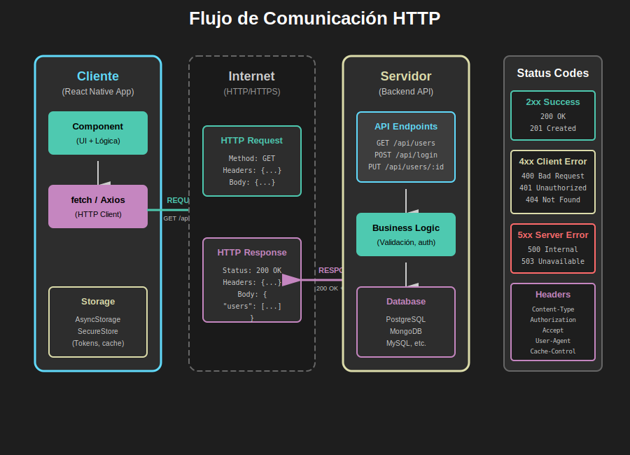

# Semana 4: APIs y Backend Integration

## 🎯 Objetivos de Aprendizaje

### 🎨 Diagrama Conceptual

**Flujo de Comunicación HTTP Cliente-Servidor**  
  
*Entiende el ciclo completo de una petición HTTP desde el cliente hasta el servidor*

> 💡 **Tip:** Este diagrama muestra la arquitectura completa de comunicación con APIs REST. [Ver todos los assets →](./0-assets/)

---

Al finalizar esta semana, serás capaz de:

- [ ] Consumir APIs REST usando `fetch` y Axios
- [ ] Implementar autenticación con tokens JWT
- [ ] Manejar estados de carga, error y éxito en peticiones HTTP
- [ ] Persistir datos sensibles de forma segura con AsyncStorage/SecureStore
- [ ] Crear hooks personalizados para consumo de APIs
- [ ] Validar y transformar datos de APIs externas
- [ ] Implementar manejo de errores robusto y user-friendly
- [ ] Gestionar headers HTTP y content types correctamente

## 📖 Contenido Teórico

### 1. Fundamentos de APIs REST

- [Conceptos básicos de HTTP](./1-teoria/01-fundamentos-http.md)
- [Métodos HTTP (GET, POST, PUT, DELETE)](./1-teoria/02-metodos-http.md)
- [Status codes y su significado](./1-teoria/03-status-codes.md)
- [Headers y Content-Type](./1-teoria/04-headers-content-type.md)

### 2. Consumo de APIs

- [Fetch API: Fundamentos](./1-teoria/05-fetch-api.md)
- [Axios: Alternativa poderosa](./1-teoria/06-axios.md)
- [Manejo de respuestas y errores](./1-teoria/07-manejo-respuestas.md)
- [Transformación de datos](./1-teoria/08-transformacion-datos.md)

### 3. Autenticación y Seguridad

- [JWT: JSON Web Tokens](./1-teoria/09-jwt-tokens.md)
- [AsyncStorage vs SecureStore](./1-teoria/10-storage-seguro.md)
- [Refresh tokens y renovación](./1-teoria/11-refresh-tokens.md)
- [Interceptores de peticiones](./1-teoria/12-interceptores.md)

### 4. Patrones y Mejores Prácticas

- [Custom hooks para APIs](./1-teoria/13-custom-hooks-api.md)
- [Estados de carga y error](./1-teoria/14-estados-ui.md)
- [Retry y timeout strategies](./1-teoria/15-retry-timeout.md)
- [Caché y optimización](./1-teoria/16-cache-optimizacion.md)

## 💻 Prácticas

### Ejercicios Básicos

1. [Consumir API pública con fetch](./2-practicas/practica-01-fetch-basico.md)
2. [Implementar headers personalizados](./2-practicas/practica-02-headers.md)
3. [Manejo de errores HTTP](./2-practicas/practica-03-manejo-errores.md)

### Ejercicios Intermedios

4. [Hook personalizado useFetch](./2-practicas/practica-04-use-fetch.md)
5. [Sistema de autenticación básico](./2-practicas/practica-05-auth-basico.md)
6. [Persistencia con AsyncStorage](./2-practicas/practica-06-async-storage.md)

### Ejercicios Avanzados

7. [Refresh token automático](./2-practicas/practica-07-refresh-token.md)
8. [Interceptores de Axios](./2-practicas/practica-08-interceptores.md)
9. [Sistema completo de autenticación](./2-practicas/practica-09-auth-completo.md)

## 🚀 Proyecto Integrador

### 📱 E-Commerce App con Backend

Desarrolla una aplicación de comercio electrónico que consume una API REST completa:

**Características principales:**

- ✅ Autenticación de usuarios (login/registro)
- ✅ Listado de productos con paginación
- ✅ Búsqueda y filtros
- ✅ Carrito de compras persistente
- ✅ Checkout con validación
- ✅ Historial de pedidos
- ✅ Manejo de errores y estados de carga
- ✅ Refresh tokens automático

**Recursos del proyecto:**

- [Descripción completa](./3-proyecto/README.md)
- [Código base con bugs](./3-proyecto/codigo-ejemplo/)
- [API de prueba](./3-proyecto/api-documentation.md)
- [Guía de implementación](./3-proyecto/guia-implementacion.md)

### 🐛 Sistema de Bugs Pedagógicos

El proyecto incluye **8 bugs intencionales** para practicar:

| Categoría     | Cantidad | Dificultad |
| ------------- | -------- | ---------- |
| **Obvios**    | 2        | Fácil      |
| **Sutiles**   | 4        | Media      |
| **Prácticas** | 2        | Alta       |

**Objetivos del sistema de bugs:**

- Identificar y corregir errores comunes en consumo de APIs
- Practicar debugging en entornos asíncronos
- Aplicar mejores prácticas de manejo de errores
- Mejorar validación de datos y edge cases

## 📚 Recursos Adicionales

### eBooks Gratuitos

- [HTTP: The Definitive Guide](./4-recursos/ebooks-free/)
- [RESTful API Design Best Practices](./4-recursos/ebooks-free/)
- [JavaScript Promises and Async/Await](./4-recursos/ebooks-free/)

### Videografía Recomendada

- [Consumo de APIs en React Native](./4-recursos/videografia/)
- [Autenticación JWT explicada](./4-recursos/videografia/)
- [AsyncStorage vs SecureStore](./4-recursos/videografia/)

### Webgrafía y Documentación

- [Fetch API - MDN](./4-recursos/webgrafia/)
- [Axios Documentation](./4-recursos/webgrafia/)
- [Expo SecureStore](./4-recursos/webgrafia/)
- [REST API Best Practices](./4-recursos/webgrafia/)

## 📖 Glosario

Términos y conceptos clave de la semana:

[Ver glosario completo](./5-glosario/README.md)

**Términos principales:**

- API (Application Programming Interface)
- REST (Representational State Transfer)
- HTTP (HyperText Transfer Protocol)
- JWT (JSON Web Token)
- CRUD (Create, Read, Update, Delete)
- Endpoint
- Header
- Status Code
- Payload
- Token
- Refresh Token
- AsyncStorage
- SecureStore

## ⏱️ Tiempo Estimado

### 📍 Sesión Presencial (6 horas obligatorias)

**Bloque 1: Fundamentos de APIs (2 horas)**

- Teoría: HTTP, REST, métodos, status codes (45 min)
- Demo: Consumir API con fetch (30 min)
- Práctica: Ejercicios 1-3 (45 min)

**Break (15 minutos)**

**Bloque 2: Autenticación y Seguridad (2 horas)**

- Teoría: JWT, AsyncStorage, tokens (45 min)
- Demo: Sistema de login completo (30 min)
- Práctica: Ejercicios 4-6 (45 min)

**Break (15 minutos)**

**Bloque 3: Proyecto Integrador (1.5 horas)**

- Introducción al proyecto E-Commerce (15 min)
- Live coding: Estructura base (30 min)
- Trabajo guiado en proyecto (45 min)

**Cierre (30 minutos)**

- Revisión de conceptos clave
- Q&A
- Asignación de bugs para identificar

### 🏠 Trabajo Autónomo (Opcional 1-2h - Solo refuerzo)

> **IMPORTANTE:** TODO se completa en la sesión presencial. El trabajo autónomo es **opcional** solo para reforzar conceptos.

**Refuerzo Opcional (~1-2 horas):**

- Revisar documentación de Fetch/Axios: 30 min
- Ver video sobre JWT: 20 min
- Experimentar con API pública: 30 min
- Personalizar estilos del proyecto: 20 min

**NO necesitas:**

- ❌ Terminar código incompleto (se termina en clase)
- ❌ Hacer ejercicios extras largos
- ❌ Estudiar toda la documentación
- ❌ Dedicar muchas horas fuera de clase

**Total Semanal: ~7-8 horas** (6h obligatorias presenciales + 1-2h opcional)

## ✅ Criterios de Evaluación

### Distribución de Puntos

| Componente | Peso    | Detalle                        |
| ---------- | ------- | ------------------------------ |
| Teoría     | 20%     | Comprensión de HTTP, REST, JWT |
| Prácticas  | 30%     | Ejercicios 1-9 completados     |
| Proyecto   | 50%     | E-Commerce app funcional       |
| **Bugs**   | **20%** | **Dentro del Proyecto (50%)**  |

### Evaluación del Sistema de Bugs (20% del Proyecto = 10% total)

El sistema de bugs vale **10 puntos** (20% de los 50 puntos del proyecto):

| Aspecto            | Puntos | Descripción                       |
| ------------------ | ------ | --------------------------------- |
| **Identificación** | 4 pts  | Encontrar y documentar los 8 bugs |
| **Corrección**     | 4 pts  | Solucionar correctamente cada bug |
| **Explicación**    | 2 pts  | Justificar la solución aplicada   |

**Detalles de evaluación completa:**

- [Ver rúbrica completa](./RUBRICA-EVALUACION.md)

## 🎓 Conceptos Clave de la Semana

Al dominar esta semana, habrás aprendido:

1. **Comunicación HTTP**: Entender cómo las apps móviles se comunican con servidores
2. **APIs REST**: Consumir servicios web siguiendo principios REST
3. **Autenticación**: Implementar login seguro con tokens JWT
4. **Estado Asíncrono**: Manejar loading, success y error states
5. **Persistencia**: Almacenar datos sensibles de forma segura
6. **Optimización**: Aplicar patrones para mejorar performance
7. **Debugging**: Identificar y corregir errores en operaciones asíncronas
8. **Mejores Prácticas**: Seguir estándares de la industria

## 🔗 Conexión con Otras Semanas

**Conocimientos previos necesarios:**

- Semana 3: Hooks (useState, useEffect, useContext)
- Semana 3: Context API para estado global
- Semana 2: Navegación entre pantallas

**Prepara para:**

- Semana 5: Integrar APIs con features nativas (cámara + upload)
- Semana 6: Deploy y optimización de apps con backend

## 💡 Tips para el Éxito

1. **Practica con APIs reales**: Usa APIs públicas para experimentar
2. **Debuggea paso a paso**: Usa console.log para seguir el flujo de datos
3. **Lee la documentación**: Fetch API y Axios son bien documentados
4. **Maneja errores siempre**: Nunca asumas que una petición funcionará
5. **Prueba casos extremos**: Sin internet, respuestas lentas, errores 500
6. **Usa herramientas**: Postman/Insomnia para probar endpoints
7. **Revisa Network**: React Native Debugger para ver peticiones HTTP

## 📞 Soporte

- **Sesión presencial**: Consultas en vivo durante las 6 horas
- **Foro del bootcamp**: Para dudas asíncronas
- **Office hours**: Martes y jueves 4-6pm (virtual)
- **Documentación**: Revisa `/_docs/` para guías adicionales

---

**¡Éxito en la Semana 4! 🚀**

_Dominar el consumo de APIs es fundamental para cualquier desarrollador móvil profesional._
