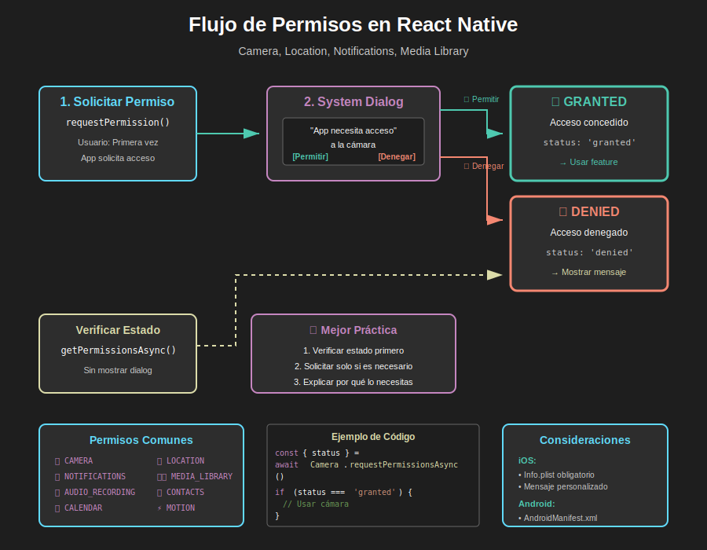
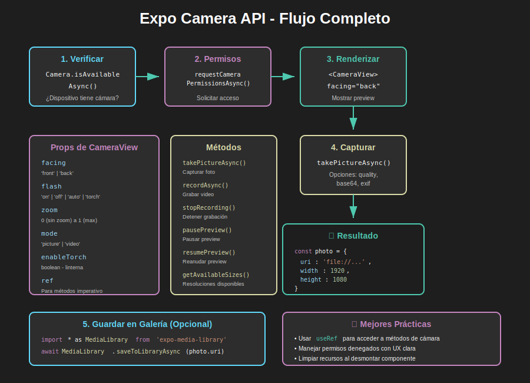

# 📱 Semana 5: Features Nativas y APIs del Dispositivo

> **Domina las APIs nativas de Expo** para crear experiencias móviles ricas: cámara, geolocalización, notificaciones push, sensores y multimedia.

---

> **🐛 IMPORTANTE:** El código de ejemplo de esta semana contiene **7 bugs intencionales** que debes identificar, corregir y documentar. Esto previene la copia mecánica y fomenta el aprendizaje activo. Ver [Sistema de Bugs Pedagógicos](../../_docs/instructor/bugs-pedagogicos.md).

---

## 📊 Vista General de la Semana

| Aspecto           | Detalle                                                        |
| ----------------- | -------------------------------------------------------------- |
| 🎯 **Enfoque**    | APIs Nativas, Permisos, Multimedia, Sensores                   |
| ⏱️ **Duración**   | 6 horas presenciales + 2-3h autónomas (refuerzo opcional)      |
| 📚 **Temas**      | Camera, Location, Notifications, ImagePicker, Sensors, Haptics |
| 💻 **Prácticas**  | 4 apps guiadas en clase (resultados inmediatos)                |
| 🚀 **Proyecto**   | Photo Gallery App completada en sesión presencial              |
| 🐛 **Bugs**       | 7 bugs pedagógicos a resolver y documentar                     |
| 📈 **Dificultad** | ⭐⭐⭐⭐ Avanzada                                              |
| ✅ **Evaluación** | 100 puntos (teoría + prácticas + proyecto + bugs)              |

---

## 🎯 Objetivos de Aprendizaje

### 🎨 Diagramas Conceptuales

**Flujo de Permisos del Sistema**  
  
_Entiende cómo solicitar y manejar permisos de forma profesional_

**Expo Camera API - Flujo Completo**  
  
_Visualiza el proceso completo de captura de fotos con la cámara_

> 💡 **Tip:** Estos diagramas muestran las mejores prácticas para trabajar con features nativas. [Ver todos los assets →](./0-assets/)

---

Al finalizar esta semana, serás capaz de:

### Conocimientos Fundamentales

- [ ] **Comprender** el sistema de permisos en iOS y Android
- [ ] **Dominar** la gestión de permisos con Expo
- [ ] **Conocer** las principales APIs nativas de Expo
- [ ] **Entender** las diferencias entre plataformas
- [ ] **Implementar** manejo robusto de errores y edge cases

### Habilidades Técnicas

- [ ] **Capturar** fotos y videos con Expo Camera
- [ ] **Seleccionar** imágenes/videos con ImagePicker
- [ ] **Obtener** ubicación GPS del usuario
- [ ] **Enviar** notificaciones push locales y remotas
- [ ] **Acceder** a sensores (acelerómetro, giroscopio)
- [ ] **Guardar** multimedia en la galería del dispositivo
- [ ] **Implementar** feedback háptico profesional

### Competencias Profesionales

- [ ] **Diseñar** UX que respete la privacidad del usuario
- [ ] **Manejar** estados de permisos (granted, denied, undetermined)
- [ ] **Optimizar** uso de batería y recursos
- [ ] **Debuggear** problemas específicos de plataforma
- [ ] **Documentar** requisitos de permisos para publicación

---

## 📚 Contenido de la Semana

### 1️⃣ [Teoría](./1-teoria/)

**Duración:** 4 horas presenciales

Fundamentos teóricos presentados con demos en vivo:

1. **[Sistema de Permisos](./1-teoria/01-sistema-permisos.md)** (45 min)

   - Arquitectura de permisos en móviles
   - Diferencias iOS vs Android
   - Mejores prácticas UX
   - Manejo de permisos denegados

2. **[Expo Camera](./1-teoria/02-expo-camera.md)** (1 hora)

   - CameraView component
   - Captura de fotos y videos
   - Props y métodos principales
   - Configuración de calidad
   - Flash, zoom, y facing

3. **[Image Picker y Media Library](./1-teoria/03-image-picker-media.md)** (45 min)

   - Seleccionar desde galería
   - Cropear y editar imágenes
   - Guardar en la galería
   - Múltiple selección

4. **[Geolocalización](./1-teoria/04-geolocalizacion.md)** (45 min)

   - Location API
   - Precisión y modos
   - Tracking en tiempo real
   - Geocoding y reverse geocoding

5. **[Notificaciones Push](./1-teoria/05-notificaciones-push.md)** (45 min)

   - Notificaciones locales
   - Expo Push Notifications
   - Scheduling y triggers
   - Manejo de interacción

6. **[Sensores y Haptics](./1-teoria/06-sensores-haptics.md)** (30 min)
   - Acelerómetro y giroscopio
   - Magnetómetro
   - Feedback háptico
   - Battery y Network info

---

### 2️⃣ [Prácticas Guiadas](./2-practicas/)

**Duración:** 3 horas presenciales (+ 1h autónoma)

Ejercicios prácticos realizados en clase con el instructor:

1. **[Camera App Básica](./2-practicas/practica-01-camera-basica.md)** (45 min)

   - Solicitar permisos
   - Renderizar CameraView
   - Capturar y previsualizar foto
   - Alternar cámara frontal/trasera

2. **[Image Gallery Selector](./2-practicas/practica-02-image-selector.md)** (45 min)

   - ImagePicker con opciones
   - Crop y aspect ratio
   - Múltiple selección
   - Guardar en MediaLibrary

3. **[Location Tracker](./2-practicas/practica-03-location-tracker.md)** (45 min)

   - Obtener ubicación actual
   - Watch position updates
   - Mostrar en mapa
   - Calcular distancia

4. **[Push Notifications](./2-practicas/practica-04-push-notifications.md)** (45 min)
   - Configurar notificaciones locales
   - Scheduling avanzado
   - Manejar tap en notificación
   - Badges y sonidos

**📝 Trabajo Autónomo Recomendado:**

- Experimentar con diferentes configuraciones de cámara
- Implementar filtros de imagen
- Practicar geofencing
- Crear notificaciones personalizadas

---

### 3️⃣ [Proyecto Integrador](./3-proyecto/)

**Duración:** 3 horas en clase (completado al 100%)

> **🚀 Photo Gallery App con Features Nativas**
>
> Aplicación completa que integra:
>
> - ✅ Captura de fotos con cámara
> - ✅ Selección desde galería
> - ✅ Agregar ubicación GPS a fotos
> - ✅ Guardar en MediaLibrary
> - ✅ Notificaciones de recordatorio
> - ✅ Feedback háptico en interacciones
> - ✅ Sistema de permisos robusto
>
> **Incluye:** 7 bugs intencionales para identificar y corregir

[Ver detalles del proyecto →](./3-proyecto/README.md)

---

### 4️⃣ [Recursos Adicionales](./4-recursos/)

Material complementario para profundizar:

#### 📚 [eBooks Gratuitos](./4-recursos/ebooks-free/)

- Expo Documentation - Native APIs
- React Native Camera Best Practices
- Mobile Permissions UX Guide

#### 🎥 [Videografía](./4-recursos/videografia/)

- Expo Camera Tutorial (oficial)
- Building a Photo App with RN
- Push Notifications Deep Dive
- Location Tracking Patterns

#### 🌐 [Webgrafía](./4-recursos/webgrafia/)

- Expo Camera Docs
- Expo Location Docs
- Expo Notifications Docs
- iOS Human Interface Guidelines
- Android Material Design Guidelines

---

### 5️⃣ [Glosario](./5-glosario/)

Términos técnicos clave de la semana:

- **Permissions**: Sistema de autorización de acceso
- **CameraView**: Componente de Expo para cámara
- **ImagePicker**: API para seleccionar multimedia
- **MediaLibrary**: Acceso a galería del dispositivo
- **Geolocation**: Ubicación GPS del dispositivo
- **Push Token**: Identificador para notificaciones
- **Haptic Feedback**: Vibración táctil de respuesta
- **Geocoding**: Convertir coordenadas a direcciones

[Ver glosario completo →](./5-glosario/README.md)

---

## ⏱️ Distribución del Tiempo

### Sesión Presencial (6 horas obligatorias)

| Actividad             | Tiempo      | Descripción                        |
| --------------------- | ----------- | ---------------------------------- |
| 🎓 Teoría + Demos     | 4 horas     | Sistema permisos, Camera, Location |
| 💻 Prácticas Guiadas  | 1.5 horas   | 4 ejercicios prácticos             |
| 🚀 Inicio Proyecto    | 30 min      | Setup y arquitectura               |
| **BREAK**             | **15 min**  | **Cada 90 minutos**                |
| **TOTAL OBLIGATORIO** | **6 horas** | **TODO completado en clase**       |

### Trabajo Autónomo (2-3h opcional - Solo refuerzo)

> **IMPORTANTE:** El bootcamp está diseñado para completar TODO en la sesión presencial. El trabajo autónomo es **opcional** solo para reforzar.

| Actividad                     | Tiempo Sugerido | Obligatorio  |
| ----------------------------- | --------------- | ------------ |
| Revisar documentación de Expo | 30-45 min       | ❌ Opcional  |
| Videos sobre Camera API       | 30-45 min       | ❌ Opcional  |
| Experimentar con sensores     | 45-60 min       | ❌ Opcional  |
| Personalizar proyecto         | 30-45 min       | ❌ Opcional  |
| **TOTAL AUTÓNOMO**            | **2-3 horas**   | **Opcional** |

**NO necesitas:**

- ❌ Completar código que no terminaste en clase (se termina en clase)
- ❌ Hacer ejercicios extras extensos
- ❌ Leer toda la documentación de Expo
- ❌ Dedicar horas fuera de la sesión

**Total Semanal: ~8-9 horas** (6h obligatorias en clase + 2-3h opcional refuerzo)

> **Filosofía:** Este bootcamp NO es para desarrollar el proyecto formativo de 7mo trimestre. Es para aprender fundamentos en 6 semanas con práctica intensiva presencial.

---

## 🐛 Sistema de Bugs Pedagógicos

El código del proyecto contiene **7 bugs intencionales** distribuidos en:

| Categoría           | Cantidad | Dificultad |
| ------------------- | -------- | ---------- |
| Permisos            | 2 bugs   | Media      |
| Camera API          | 2 bugs   | Media-Alta |
| Estado y Refs       | 1 bug    | Media      |
| Manejo de Errores   | 1 bug    | Alta       |
| Performance/Memoria | 1 bug    | Alta       |

### Proceso de Identificación

1. **Ejecutar** el proyecto y probar todas las funcionalidades
2. **Identificar** comportamientos incorrectos o warnings
3. **Analizar** el código fuente para encontrar la causa
4. **Corregir** aplicando las mejores prácticas
5. **Documentar** en el solucionario personal

[Ver guía de bugs →](./3-proyecto/BUGS-GUIA.md)

---

## ✅ Criterios de Evaluación

Ver [RUBRICA-EVALUACION.md](./RUBRICA-EVALUACION.md) para detalles completos.

### Distribución de Puntos

| Criterio              | Peso | Puntos  |
| --------------------- | ---- | ------- |
| 🎓 Teoría             | 15%  | 15      |
| 💻 Prácticas          | 25%  | 25      |
| 🚀 Proyecto           | 40%  | 40      |
| 🐛 Bugs Identificados | 20%  | 20      |
| **TOTAL**             | 100% | **100** |

### Aspectos Clave

✅ **Manejo de Permisos** (Critical)

- Solicitar permisos correctamente
- Manejar estados denied y undetermined
- UX clara cuando no hay permisos

✅ **Implementación de Camera** (Critical)

- CameraView configurado correctamente
- Captura funcional
- Manejo de errores

✅ **Calidad del Código** (Important)

- Limpieza de recursos
- Manejo de memoria
- Performance optimizado

✅ **Resolución de Bugs** (Important)

- Identificación completa
- Correcciones efectivas
- Documentación detallada

---

## 📦 Dependencias Necesarias

```bash
# APIs Nativas principales
pnpm add expo-camera expo-image-picker expo-media-library

# Ubicación y mapas
pnpm add expo-location react-native-maps

# Notificaciones
pnpm add expo-notifications expo-device

# Sensores y utilidades
pnpm add expo-sensors expo-haptics expo-battery expo-network

# TypeScript types (opcional)
pnpm add -D @types/react-native-maps
```

---

## 🔧 Configuración Requerida

### app.json / app.config.js

```json
{
  "expo": {
    "plugins": [
      [
        "expo-camera",
        {
          "cameraPermission": "La app necesita acceso a la cámara para capturar fotos."
        }
      ],
      [
        "expo-location",
        {
          "locationAlwaysAndWhenInUsePermission": "La app necesita tu ubicación para agregar GPS a las fotos."
        }
      ],
      [
        "expo-media-library",
        {
          "photosPermission": "La app necesita acceso para guardar fotos en tu galería.",
          "savePhotosPermission": "La app necesita permiso para guardar fotos."
        }
      ]
    ],
    "notification": {
      "icon": "./assets/notification-icon.png",
      "color": "#000000"
    }
  }
}
```

---

## 💡 Consejos para el Éxito

### Durante la Teoría

- 📝 Toma notas sobre requisitos de permisos
- 🔍 Observa las diferencias iOS/Android
- 💭 Piensa en casos edge (permisos denegados)
- 📱 Prueba en dispositivo real cuando sea posible

### Durante las Prácticas

- ✅ Implementa manejo de errores desde el inicio
- 🧪 Prueba en ambos escenarios (permisos granted/denied)
- 🔄 Limpia recursos al desmontar componentes
- 📊 Monitorea warnings de memoria

### Durante el Proyecto

- 🐛 Identifica bugs ejecutando todas las features
- 📱 Prueba en diferentes dispositivos/simuladores
- ⚡ Optimiza para performance
- 📚 Documenta decisiones de arquitectura

---

## 🚀 Recursos de Preparación

### Antes de la Sesión (Opcional)

- [ ] Revisar [documentación de Expo Camera](https://docs.expo.dev/versions/latest/sdk/camera/)
- [ ] Leer sobre [sistema de permisos en móviles](https://developer.apple.com/design/human-interface-guidelines/privacy)
- [ ] Familiarizarse con [Expo Location](https://docs.expo.dev/versions/latest/sdk/location/)

### Durante la Semana

- [ ] Completar las 4 prácticas guiadas
- [ ] Identificar y corregir los 7 bugs
- [ ] Implementar el proyecto completo
- [ ] Documentar aprendizajes clave

---

## 📞 Soporte y Ayuda

### Durante Sesión Presencial

- 🙋 Preguntar al instructor en tiempo real
- 👥 Colaborar con compañeros (pair programming)
- 🔍 Usar debugger para investigar bugs

### Fuera de Sesión (Opcional)

- 💬 Foro del bootcamp para preguntas
- 📧 Email al instructor (respuesta en 24-48h)
- 📚 Documentación oficial de Expo
- 🌐 Stack Overflow con tag `expo` o `react-native`

---

## 🎯 Próximos Pasos

Al completar esta semana:

1. ✅ Habrás dominado las principales APIs nativas de Expo
2. ✅ Sabrás manejar permisos profesionalmente
3. ✅ Podrás crear apps con multimedia rica
4. ✅ Estarás preparado para la **Semana 6: Deployment**

---

## 🔗 Enlaces Rápidos

- [📚 Teoría Completa](./1-teoria/)
- [💻 Prácticas](./2-practicas/)
- [🚀 Proyecto](./3-proyecto/)
- [📖 Glosario](./5-glosario/)
- [📊 Rúbrica](./RUBRICA-EVALUACION.md)
- [🐛 Bugs Guía](./3-proyecto/BUGS-GUIA.md)

---

**¡Prepárate para crear experiencias móviles nativas impresionantes!** 📱✨

_Bootcamp React Native - Semana 5_  
_Features Nativas y APIs del Dispositivo_
